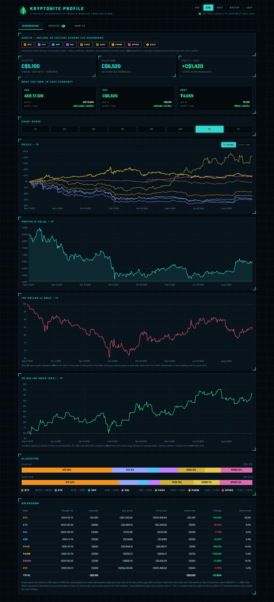
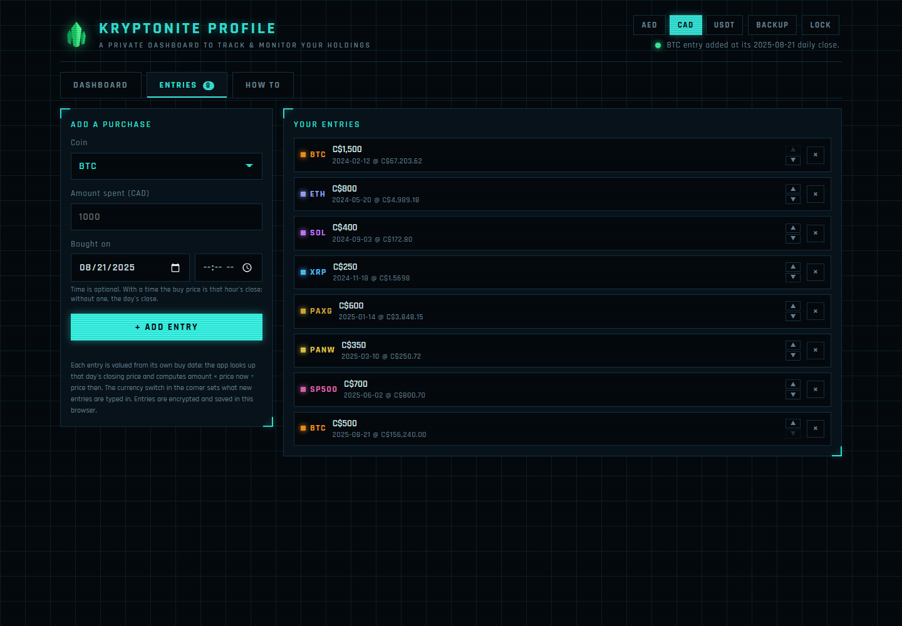
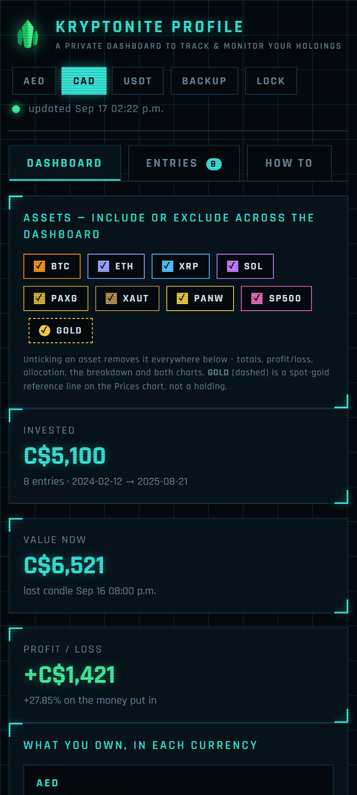
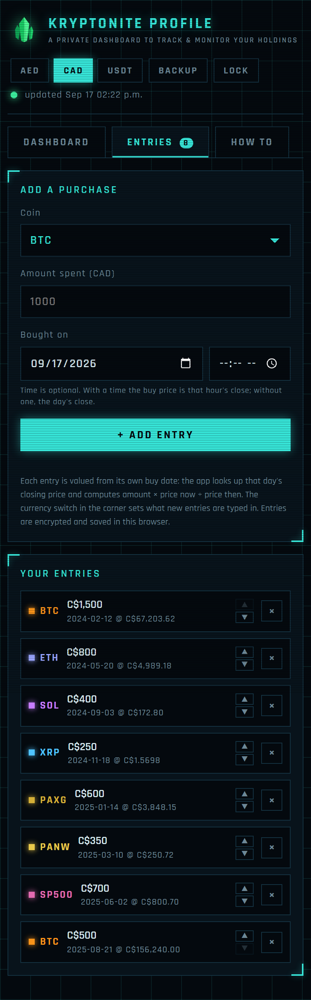
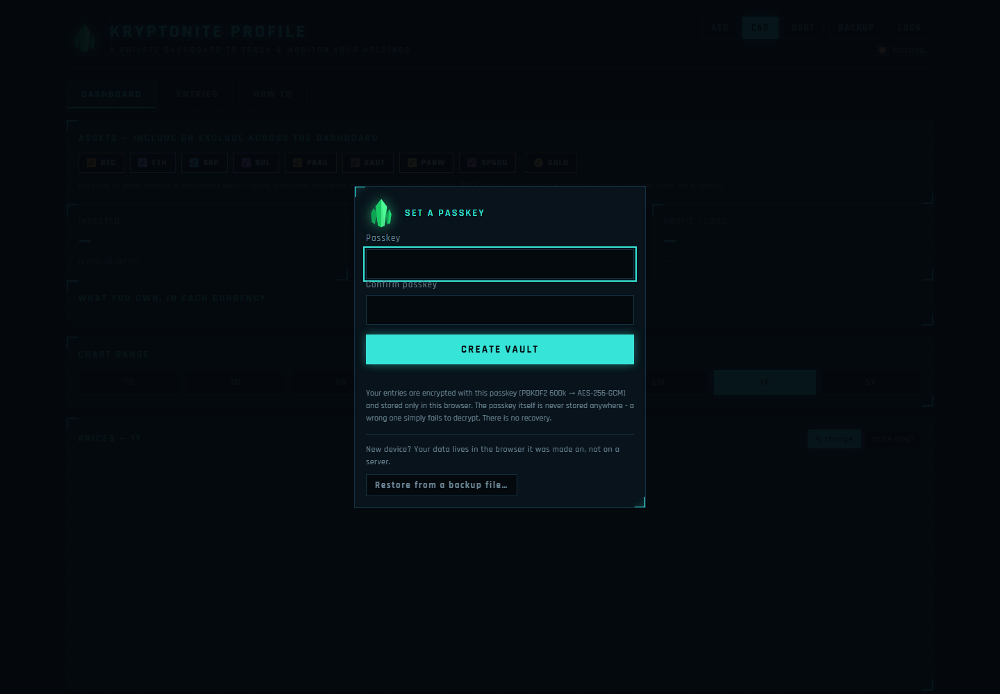

# Kryptonite Profile

A single-page, static backtest for **BTC, ETH, XRP, SOL, PAXG, XAUT, PANW** (Palo Alto Networks stock) **and the S&P 500** (via the SPY ETF). You log the
purchases you actually made - coin, what you spent, and the date - and the app looks
up that day's closing price, then tracks what each entry is worth now and over time.

## Screenshots

Captured in a private browsing window with a throwaway vault and made-up purchases — eight small CAD entries spread over 2024–2025. The vault was deleted afterwards; nothing in these images is a real holding. The prices are the live market data the page fetches.

The dashboard: totals in every currency, price history, the portfolio value curve, dollar-vs-gold and DXY references, allocation and the per-entry breakdown.



The Entries tab, and the dashboard on a phone:

<p> </p>

Entries on a phone, and a first visit — no vault exists yet, so the page asks for a passkey before anything can be entered:

<p> </p>

## What it does

- **Buy entries.** Each entry = coin + amount + purchase date, typed in the currency
  selected in the corner (AED / CAD / USDT). The app fetches the daily close for that
  exact date and values the holding as `amount x price(now) / price(buy date)`.
- **Totals in every currency.** What you own, what you put in, and profit/loss are
  shown in AED, CAD and USDT side by side. "Put in" converts your spend at the buy
  date's FX rate - the money you actually parted with, not a moving target.
- **Charts.** Price history for the four coins (% change or log price) and the
  portfolio value curve, which steps up as entries come in.
- **Encrypted vault.** Everything you save is AES-256-GCM encrypted in your browser's
  localStorage with a key derived from your passkey (PBKDF2-HMAC-SHA256, 600k
  iterations, random salt). The passkey is never stored or transmitted; a wrong
  passkey simply fails to decrypt. There is no recovery if you forget it. **Passkey**
  (top-right) changes it: the vault is re-encrypted under the new passkey with a fresh
  salt, and older backups keep opening with the passkey they were made with.
- **Stay unlocked (opt-in).** Tick it on the lock screen and the browser keeps the derived
  AES key - never the passkey - as a non-extractable key in IndexedDB, so the page opens
  without asking. Useful on a phone, where the browser reloads the tab constantly. Anyone
  with that browser profile can then open the data; **Lock** forgets the key.

## Privacy model

The page is static - there is no backend and no account. Your entries never leave
your browser, and the repository contains no secrets of any kind: authentication is
the ability to decrypt your own local data. Crypto prices come from Binance (CryptoCompare fallback); PANW from stockanalysis.com
(split/dividend-adjusted daily closes, native CORS, no key); FX history from Frankfurter
(ECB reference rates). AED uses the fixed 3.6725 peg and USDT is counted 1:1 with USD.

The **market strip** under the header shows live BTC / ETH / SOL / XRP / BNB from Binance's
24-hour ticker (CoinGecko fallback) and the US market via the SPY, DIA, QQQ and IWM ETFs from
stockanalysis.com quotes. Public prices only - it loads regardless of the vault and refreshes
every minute. It is hidden by default: click the word **MARKETS** to show or hide the prices, and
the choice is remembered in that browser.

## Running it

Open `index.html`, or serve the folder statically:

```bash
python -m http.server 8899
```

Hosted at: https://offport.github.io/kryptonite-profile/

**Cross-device:** your encrypted vault lives only in the browser it was made in (per-origin
localStorage, never on GitHub). To use it on another device, press **Backup** to download the
encrypted file, move it over, and choose **Restore from a backup file** on the lock screen — the
same passkey then unlocks the same data. The backup is ciphertext; it is useless without the passkey.
